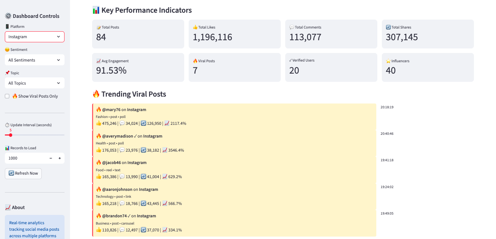
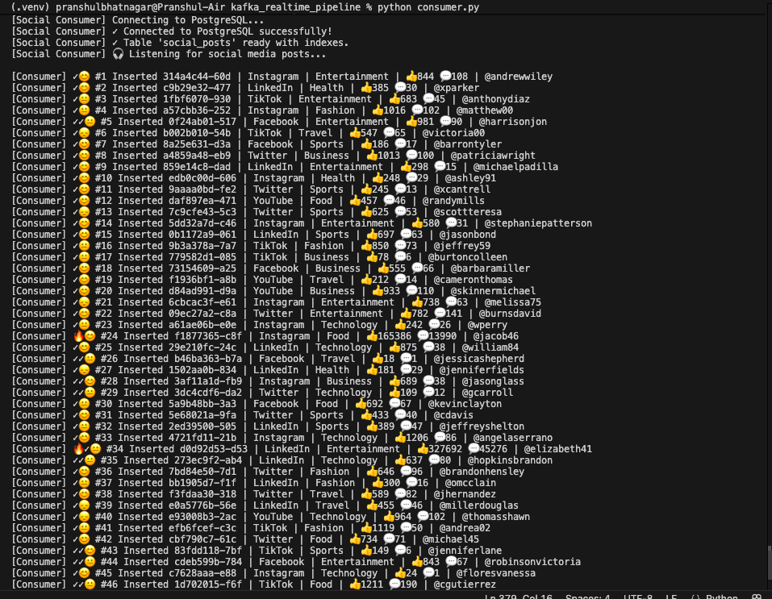
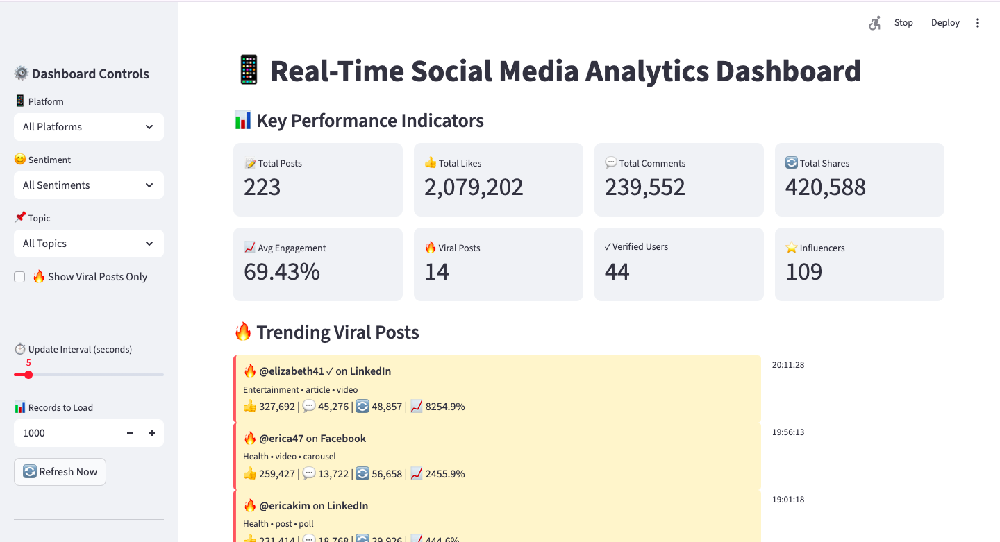
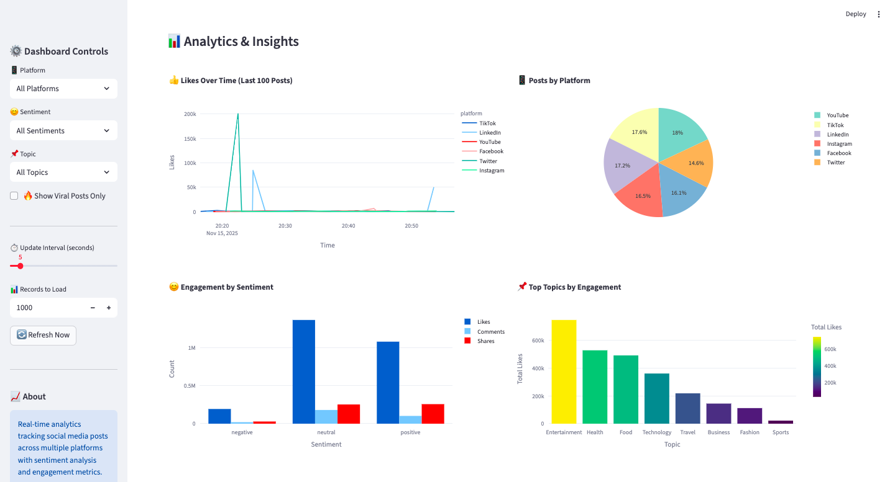
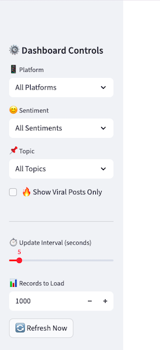
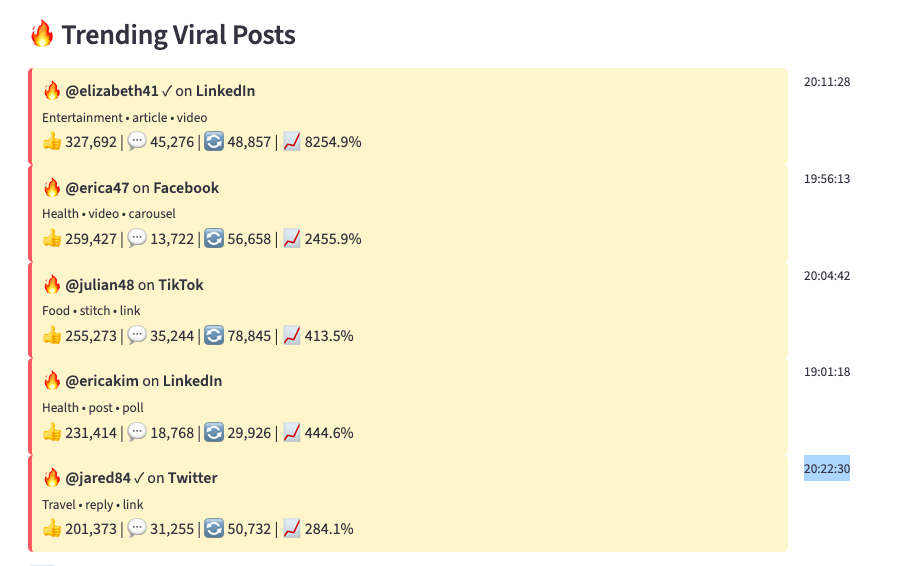
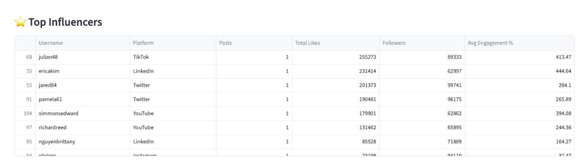
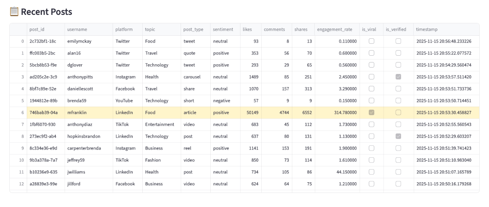
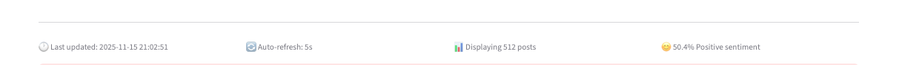

# 📱 Real-Time Social Media Analytics System



This system simulates and analyzes real-time social media activity across multiple platforms (Twitter, Instagram, Facebook, LinkedIn, TikTok, YouTube). It demonstrates enterprise-grade data engineering patterns including:

- **Event-driven architecture** using Apache Kafka
- **Stream processing** with real-time data ingestion
- **ETL pipelines** for data transformation and loading
- **Real-time analytics** with interactive dashboards
- **Sentiment analysis** and engagement tracking
- **Viral content detection** and influencer monitoring

### Use Cases

- Social media monitoring and analytics
- Brand sentiment tracking
- Influencer marketing analysis
- Trend detection and hashtag analytics
- Engagement rate optimization
- Competitive analysis
- Crisis management and rapid response


## 📁 Project Structure

```
social-media-analytics/
    │
    ├── producer.py              # Kafka producer - generates social posts
    ├── consumer.py              # Kafka consumer - writes to database
    ├── dashboard.py             # Streamlit dashboard - visualization
    ├── docker-compose.yml       # Infrastructure configuration
    ├── requirements.txt         # Python dependencies
    ├── Results                  # Containes screenshots of the dashboard
    ├── README.md               # This file
    │
    ├── .venv/                  # Virtual environment (optional)

```

### File Descriptions

#### `producer.py`
- Generates synthetic social media posts
- Simulates multiple platforms (Twitter, Instagram, etc.)
- Creates realistic engagement metrics
- Implements viral content detection
- Sends data to Kafka topic `social_media`

**Key Functions:**
- `generate_social_post()`: Creates synthetic post data
- `run_producer()`: Main producer loop

#### `consumer.py`
- Consumes messages from Kafka
- Transforms and validates data
- Writes to PostgreSQL database
- Creates indexes for query optimization
- Handles errors gracefully

**Key Functions:**
- `run_consumer()`: Main consumer loop with database insertion

#### `dashboard.py`
- Real-time Streamlit dashboard
- Interactive visualizations using Plotly
- Multiple filter options
- Auto-refresh capability
- KPI tracking and analytics

**Key Features:**
- 8 KPI metrics
- 10+ visualizations
- Advanced filtering
- Influencer leaderboard
- Viral content tracking

#### `docker-compose.yml`
- Defines Kafka and PostgreSQL services
- Configures networking and volumes
- Sets environment variables
- Manages service dependencies

#### `requirements.txt`
```txt
kafka-python==2.0.2
psycopg2-binary==2.9.9
pandas==2.1.4
plotly==5.18.0
streamlit==1.29.0
sqlalchemy==2.0.23
faker==22.0.0
```


## ✨ Features

### Data Generation & Streaming
- Multi-platform support (Youtube, LinkeIn, Instagram, Facebook, Twitter, TikTok)
- Realistic synthetic data generation
- Configurable post frequency and patterns
- Viral content simulation (surge detection)
- Sentiment analysis (positive/neutral/negative)
- Geographic tagging for posts
- Hashtag and topic tracking

### Analytics & Insights
- Real-time engagement metrics (likes, comments, shares)
- Sentiment trend analysis
- Platform performance comparison
- Influencer identification and leaderboard
- Viral content tracking
- Hashtag trending analysis
- Geographic distribution mapping
- Content type performance metrics

### Dashboard
- 8 comprehensive KPI metrics
- 10+ interactive visualizations
- Auto-refresh capability (configurable interval)
- Advanced filtering (platform, sentiment, topic, viral)
- Responsive design
- Real-time data updates
- Export-ready analytics


## System Architecture

```
┌─────────────────────┐
│   Producer.py       │
│  Data Generator     │
│  - Synthetic Posts  │
│  - Multi-Platform   │
│  - Sentiment        │
└──────────┬──────────┘
           │
           ▼
┌─────────────────────┐
│   Apache Kafka      │
│  Message Broker     │
│  Topic: social_media│
└──────────┬──────────┘
           │
           ▼
┌─────────────────────┐
│   Consumer.py       │
│  Stream Processor   │
│  - Read from Kafka  │
│  - Transform Data   │
└──────────┬──────────┘
           │
           ▼
┌─────────────────────┐
│   PostgreSQL        │
│  Data Warehouse     │
│  Table: social_posts│
└──────────┬──────────┘
           │
           ▼
┌─────────────────────┐
│   Dashboard.py      │
│  Streamlit App      │
│  - Real-time Viz    │
│  - Analytics        │
└─────────────────────┘
```

# 📦 Tech Stack

| Component | Technology                      | Purpose                         |
| --------- | ------------------------------- | ------------------------------- |
| Producer  | Python + Faker + Kafka Producer | Generate synthetic social posts |
| Broker    | Apache Kafka 7.4.0              | Real-time data streaming        |
| Consumer  | Python + Kafka Consumer         | Transform + Load into database  |
| Storage   | PostgreSQL 15                   | Structured analytics warehouse  |
| Dashboard | Streamlit + Plotly              | Visualization + analytics layer |


# 🚀 Installation Guide

### 1️⃣ Clone Repository

```bash
git clone https://github.com/yourusername/social-media-analytics.git
cd social-media-analytics
```

### 2️⃣ Setup Files

Ensure these files exist:

```
producer.py
consumer.py
dashboard.py
docker-compose.yml
requirements.txt
```

### 3️⃣ Install Dependencies

```bash
python -m venv .venv
source .venv/bin/activate     # macOS/Linux
# OR
.venv\Scripts\activate        # Windows

pip install -r requirements.txt
```

### 4️⃣ Start Kafka + PostgreSQL

```bash
docker-compose up -d
docker-compose ps
```

Expected:

```
kafka    Up
postgres Up
```

⚠️ Kafka takes **30–60 seconds** to initialize.

Check status:

```bash
docker logs kafka | grep "started"
```


## ⚡ Quick Start

### Running the Complete System

Open **3 separate terminal windows**:

#### Terminal 1: Start Consumer
```bash
python consumer.py
```

**Output:**



#### Terminal 2: Start Producer
```bash
python producer.py
```

**Output:**


#### Terminal 3: Start Dashboard
```bash
streamlit run dashboard.py
```

### Access the Dashboard

Open your web browser and navigate to:
```
http://localhost:8501
```


## 📊 Dashboard Features

### KPI Metrics

1. **Total Posts**: Count of all social media posts
2. **Total Likes**: Aggregate likes across all posts
3. **Total Comments**: Sum of all comments
4. **Total Shares**: Total share count
5. **Average Engagement**: Mean engagement rate (%)
6. **Viral Posts**: Count of viral content (high engagement)
7. **Verified Users**: Number of verified accounts
8. **Influencers**: Count of influencer accounts (50K+ followers)



### Visualizations

#### 1. Likes Over Time (Line Chart)
- Shows temporal trends in post likes
- Color-coded by platform
- Last 100 posts displayed


#### 2. Posts by Platform (Pie Chart)
- Distribution of posts across platforms
- Interactive hover details
- Percentage breakdown

#### 3. Engagement by Sentiment (Grouped Bar Chart)
- Compares likes, comments, shares by sentiment
- Identifies which sentiment drives most engagement
- Side-by-side comparison

#### 4. Top Topics by Engagement (Bar Chart)
- Displays 8 most engaging topics
- Sorted by total likes
- Color gradient visualization



#### 5. Content Type Performance (Bar Chart)
- Average engagement rate by content type
- Identifies best-performing content formats
- Helps optimize content strategy

#### 6. Geographic Distribution (Bar Chart)
- Top 10 locations by post volume
- Color-coded by total likes
- Identifies key markets

#### 7. Trending Hashtags (Horizontal Bar Chart)
- Top 15 most-used hashtags
- Real-time trend tracking
- Frequency count displayed

#### 8. Post Types by Platform (Sunburst Chart)
- Hierarchical view of post types
- Drill-down capability
- Interactive exploration


### Filters

- **Platform**: Filter by social media platform
- **Sentiment**: Filter by positive/neutral/negative
- **Topic**: Filter by content topic
- **Viral Only**: Show only viral posts



## Additional Features

**Viral Posts Feed**: Real-time feed of trending content




**Influencer Leaderboard**: Top 10 influencers by engagement



**Recent Posts Table**: Last 20 posts with all details




**Configurable Parameters**: Configurable update interval, platform, sentiment, topics.


**Snapshot Bar**: A concise page summary at the end of page showing last updated time, the current auto-refresh interval, the total number of posts currently rendered, and the proportion of posts classified as positive sentiment.


---

## 📐 Data Schema


| Column | Type | Description |
|--------|------|-------------|
| `post_id` | VARCHAR(50) | Unique post identifier |
| `user_id` | VARCHAR(50) | User identifier |
| `username` | VARCHAR(100) | Display username |
| `platform` | VARCHAR(50) | Social media platform |
| `post_type` | VARCHAR(50) | Type of post (tweet, reel, etc.) |
| `content_type` | VARCHAR(50) | Content format (text, video, image) |
| `topic` | VARCHAR(100) | Content topic/category |
| `hashtags` | TEXT[] | Array of hashtags |
| `sentiment` | VARCHAR(20) | Sentiment (positive/neutral/negative) |
| `location` | VARCHAR(100) | Geographic location |
| `likes` | INTEGER | Number of likes |
| `shares` | INTEGER | Number of shares |
| `comments` | INTEGER | Number of comments |
| `views` | INTEGER | Number of views (video content) |
| `engagement_rate` | NUMERIC(8,2) | Engagement rate percentage |
| `followers` | INTEGER | Account follower count |
| `is_verified` | BOOLEAN | Verified account flag |
| `is_influencer` | BOOLEAN | Influencer status flag |
| `is_viral` | BOOLEAN | Viral content flag |
| `timestamp` | TIMESTAMP | Post creation time |
| `language` | VARCHAR(10) | Content language code |

---

## 🐛 Troubleshooting

### Common Issues

#### 1. Kafka Connection Failed

**Error:**
```
kafka.errors.NoBrokersAvailable: NoBrokersAvailable
```

**Solutions:**

```bash
# Check if Kafka is running
docker ps | grep kafka

# If not running, start it
docker-compose up -d kafka

# Wait 30-60 seconds for Kafka to initialize
sleep 60

# Check Kafka logs
docker logs kafka

# Look for: "Kafka Server started"

# Restart if needed
docker-compose restart kafka
```

#### 2. PostgreSQL Connection Failed

**Error:**
```
psycopg2.OperationalError: could not connect to server
```

**Solutions:**

```bash
# Check if PostgreSQL is running
docker ps | grep postgres

# If not running, start it
docker-compose up -d postgres

# Test connection
docker exec -it postgres psql -U kafka_user -d kafka_db -c "SELECT 1;"

# Check logs
docker logs postgres

# Restart if needed
docker-compose restart postgres
```

#### 3. Consumer Not Receiving Messages

**Checklist:**
- [ ] Producer is running and sending messages
- [ ] Consumer is subscribed to correct topic (`social_media`)
- [ ] Kafka is healthy and accessible
- [ ] No firewall blocking port 9092

**Debug:**

```bash
# List all Kafka topics
docker exec -it kafka kafka-topics --list --bootstrap-server localhost:9092

# Check messages in topic
docker exec -it kafka kafka-console-consumer \
  --topic social_media \
  --bootstrap-server localhost:9092 \
  --from-beginning \
  --max-messages 5

# Check consumer group status
docker exec -it kafka kafka-consumer-groups \
  --bootstrap-server localhost:9092 \
  --group social-media-consumer-group \
  --describe
```

#### 4. Dashboard Shows No Data

**Checklist:**
- [ ] Consumer has written data to database
- [ ] Database connection is working
- [ ] Table `social_posts` exists
- [ ] Data exists in table

**Verify:**

```bash
# Check record count
docker exec -it postgres psql -U kafka_user -d kafka_db \
  -c "SELECT COUNT(*) FROM social_posts;"

# View sample data
docker exec -it postgres psql -U kafka_user -d kafka_db \
  -c "SELECT * FROM social_posts LIMIT 5;"

# List tables
docker exec -it postgres psql -U kafka_user -d kafka_db -c "\dt"
```

#### 5. Module Not Found Errors

**Error:**
```
ModuleNotFoundError: No module named 'kafka'
```

**Solution:**

```bash
# Ensure virtual environment is activated
source .venv/bin/activate  # macOS/Linux
.venv\Scripts\activate     # Windows

# Install all dependencies
pip install -r requirements.txt

# Verify installation
pip list | grep kafka
```

#### 6. Port Already in Use

**Error:**
```
Error: Port 9092 is already in use
```

**Solution:**

```bash
# Find process using port
lsof -i :9092  # macOS/Linux
netstat -ano | findstr :9092  # Windows

# Stop the process or change port in docker-compose.yml
docker-compose down
docker-compose up -d
```

---

# Author: Pranshul Bhatnagar
